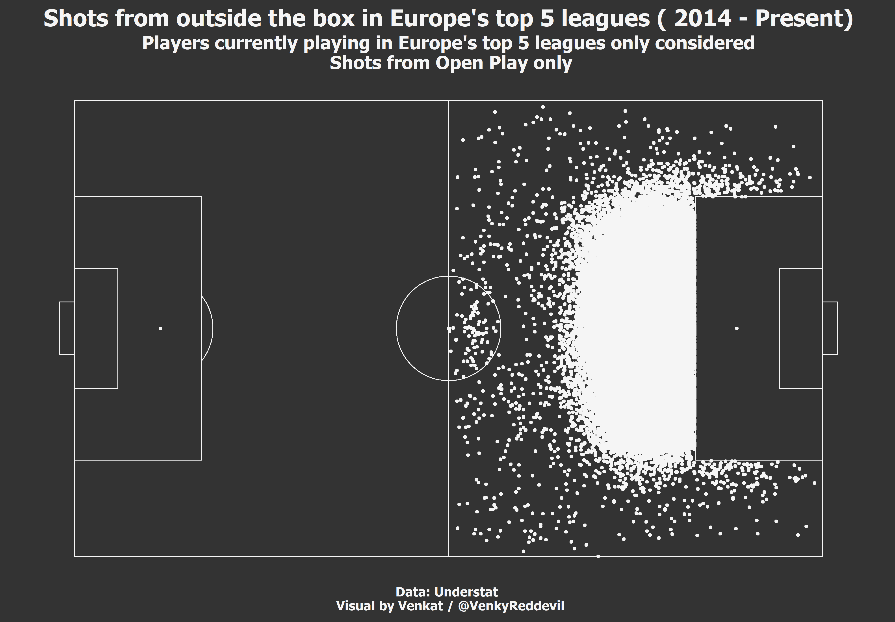

## A statistical data analysis to find the best shooters from Outside the box [Jan 11, 2021] ##

Some players like Cristiano Ronaldo, Lionel Messi, Philippe Countinho, Kevin De Bruyne are all known to shoot well from outside the box. I did a statistical
data analysis to find out which other players are good at shooting from outside the box. To do this analysis, I used the data from understat to find out which
players from Europe's top 5 leagues are good at shooting from outside the box.

You can read the full analysis [here](https://footytistics.com/2021-01-11-otb-shooting/).

Note: This project could be expanded more and that is something I will be doing soon.

Some of the visuals created for this analysis below:

#### Open Play shots from outside the box since 2014 ####

